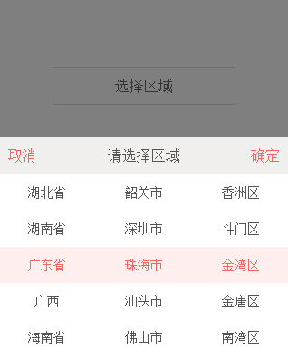

#移动端省市区选择控件
##效果截图

插件依赖jquery或者zepto库

模拟原生UI以及交互，减少用户操作，目前只支持三级联动

这是一个简单的移动端省市区选择控件，由于工作项目中的一个功能需求，网上找不到相似的组件，所以自己造轮子

时间有限写得简陋，如果有bug欢迎提出来
##用法
###带默认选中值
```javascript
$(".pick-btn").cityPicker({
		prov:"广东省",
		city:"广州市",
		dist:"海珠区",
		confirm:function(data){
			console.log(data.prov+data.city+data.dist);
		}
});
```
###不带默认选中值
```javascript
$(".pick-btn").cityPicker({
		confirm:function(data){
			console.log(data.prov+data.city+data.dist);
		}
});
```
